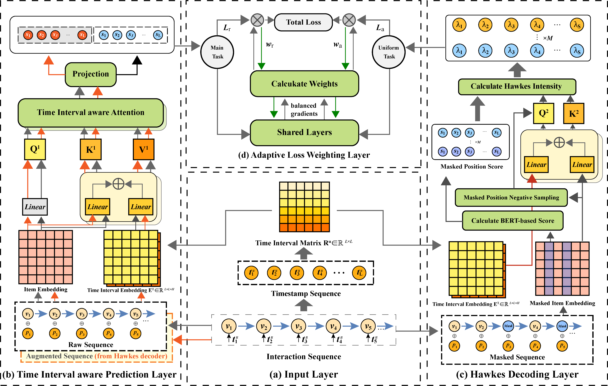
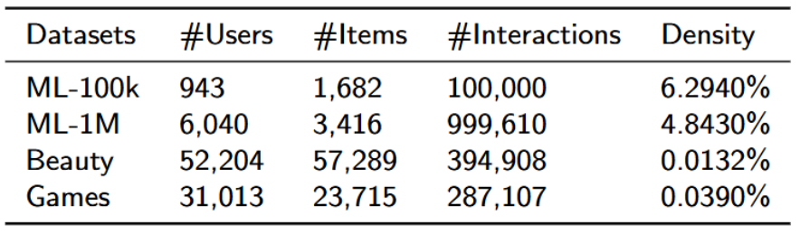

# HTSARec

This is the PyTorch implementation for our paper. The code is built on the [RecBole](https://github.com/RUCAIBox/RecBole) library.

* The model implementation is at `recbole/model/sequential_recommender/htsarec.py`

## Overview

**HTSARec** is a novel framework designed for **Sequential Recommendation**, tackling key challenges in real-world user interaction data such as **data sparsity, irregular time intervals, and semantic drift** caused by conventional data augmentation. 

<div align="center"> 
  
</div>

---

### Key Features

* **Hawkes-Process-Driven Augmentation**: Integrates a Transformer-based bidirectional encoder with a time-aware self-attention mechanism to construct a learnable Hawkes-process kernel. This generates semantically consistent augmented samples with uniform temporal intervals, avoiding random-perturbation noise.
* **Multi-Scale Temporal Dependencies**: Incorporates a fine-grained, discretized time-interval encoding mechanism to effectively capture complex temporal dynamics.
* **Adaptive Loss-Weighting**: Dynamically adjusts task weights during training to mitigate task conflicts and prevent overfitting.
## Environments

* Python 3.8.20
* torch = 1.11.0
* numpy >= 1.19.2
* scipy = 1.6.0
* pandas >= 1.4.4
* tqdm = 4.66.2
* scikit-learn = 1.2.1
* pyyaml = 6.0.2
* tensorboard = 2.10.0
* thop >= 0.1.1
* ray >= 1.13.0, <= 2.10.0

You can also install dependencies via:

```bash
pip install -r requirements.txt
```

## Datasets
Following is the statistics of the datasets we use.

<div align="center">

</div>

You can find the original data in these links:
* **ml-100k** / **ml-1m** — [GroupLens](https://grouplens.org/datasets/movielens/)
* **Beauty** / **Games** — [Amazon Review Data](https://jmcauley.ucsd.edu/data/amazon/)

## Run the Code
### On ML-100K dataset:

```bash
python run.py --dataset=ml-100k
```

### Training on other dataset

```bash
python run.py --dataset=<dataset_name>
```
## Configuration / Hyperparameters

All model-specific hyperparameters are defined in `recbole/properties/model/HTSARec.yaml`. Dataset-specific settings (max sequence length, filtering, field definitions, etc.) are defined in the corresponding `.yaml` file under `recbole/properties/dataset/`. Overall defaults are in `recbole/properties/overall.yaml`.

